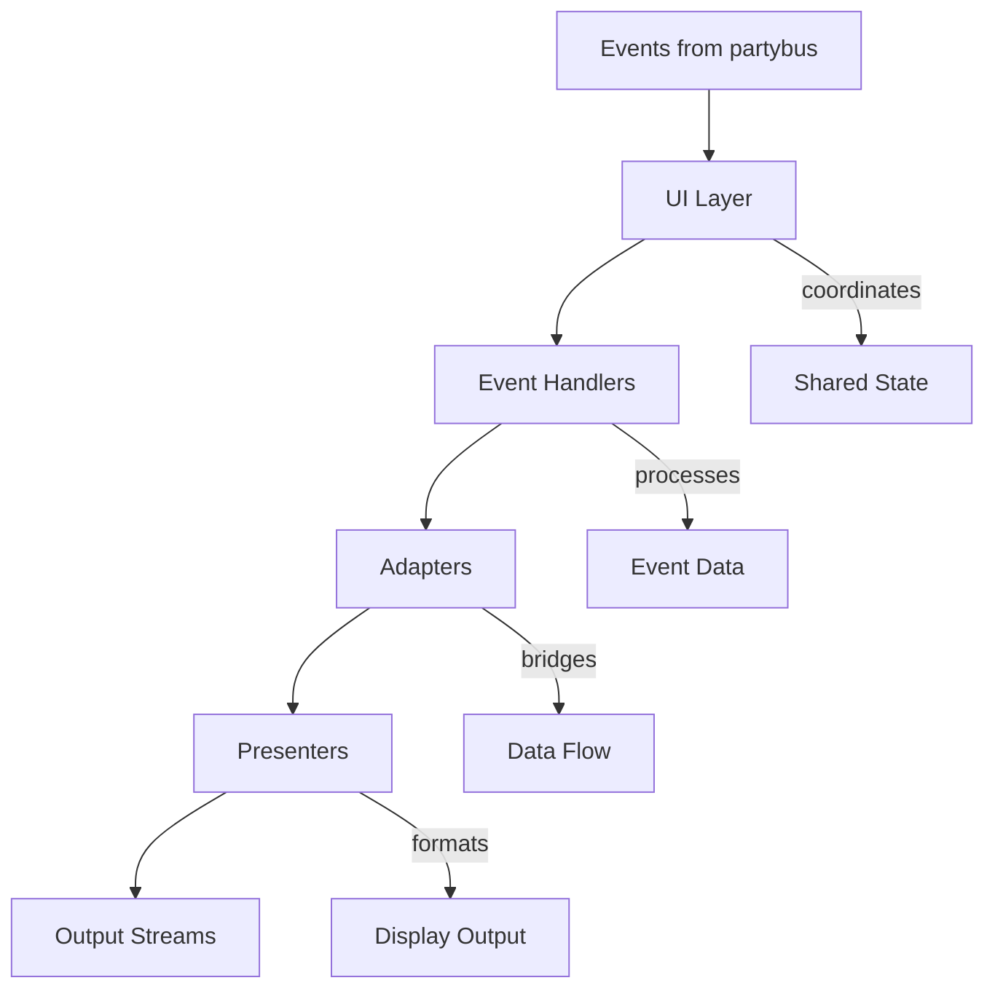

# UI Architecture

## Overview

Canopy's UI system uses a layered, event-driven architecture that cleanly separates event processing, data transformation, and output presentation. This design supports both interactive terminal interfaces (via Bubble Tea) and streaming text output for CI/CD environments.

## Architecture at a Glance



The flow is straightforward: **Events** → **Handlers** → **Adapters** → **Presenters** → **Output**

## Core Components

### UI Layer: Environment Detection & Orchestration

The UI layer detects the runtime environment and coordinates all other components.

#### SimpleUI (`simple_ui.go`)
For non-interactive environments (CI/CD, piped output):
```go
// handles streaming text output
ui := newSimpleUI().
    withHandlers(testHandler).
    withStdout(os.Stdout).
    withStderr(os.Stderr)
```

#### TeaUI (`tea_ui.go`)
For interactive terminal sessions:
```go
// wraps SimpleUI + adds Bubble Tea interactivity
teaUI := NewTeaUI(config).
    WithSimpleUI(simpleUI).
    WithFooter(summaryHandler).
    WithSyncSpinner(spinner)
```

**Key Insight**: TeaUI wraps SimpleUI rather than replacing it, ensuring consistent event handling across both modes.

### Handlers: Event Processing

Handlers convert raw events into structured data. They implement a simple interface:

```go
type Handler interface {
    BusHandler           // Handle(event) error
    TestEventHandler     // OnGoTestEvent(gotest.Event) error
    fmt.Stringer        // String() string (buffered output)
}
```

**Common Handlers**:
- `VerboseHandler`: Detailed output with timing and package information
- `QuietHandler`: Shows only failures and final results
- `SummaryHandler`: Aggregates statistics for footer display

### Adapters: Interface Bridge

Adapters solve a common problem: handlers process events but presenters format output. Adapters implement both interfaces, acting as a bridge:

```go
type HandledPresenter interface {
    partybus.Handler     // processes events
    presenter.Presenter  // formats output
}
```

This pattern eliminates the need for complex component coupling.

### Presenters: Output Formatting

Presenters take processed data and generate formatted output:

```go
type Presenter interface {
    Present(stdout, stderr io.Writer) error
}
```

**Factory Pattern**: Presenters are created via factories that can produce different presenters based on configuration:

```go
factory := gostd.NewFactory(config)
presenter := factory.Create(eventType)
presenter.Present(stdout, stderr)
```

## Data Flow in Action

Here's how a test failure flows through the system:

```
1. Go test fails → partybus.Event
2. UI routes event → Handler
3. Handler processes test data → structured failure info
4. Adapter bridges → Presenter
5. Presenter formats → colored error output
6. Output streams → terminal/file
```

## Real Example: Test Runner UI

The `test_go_ui.go` file shows how components work together:

```go
func newDynamicGoUI(cfg TestUIConfig, maxPkgNameLength int) clio.UI {
    // shared state for spinner animation
    spin := syncspinner.New()

    // separate I/O streams for different output types
    reportReader, reportWriter := readerWriterPair()
    notificationReader, notificationWriter := readerWriterPair()

    // handler selection based on verbosity
    var h handler.Handler
    if cfg.Verbose > 0 {
        h = gostd.NewVerboseHandler(reportWriter, config)
    } else {
        h = gostd.NewQuietHandler(reportWriter, config)
    }

    // build the base UI with streaming capability
    ux := newSimpleUI().
        withNotifications().
        withReports().
        withHandlers(h).
        withStdout(reportWriter).
        withStderr(notificationWriter)

    // add interactive footer for live updates
    summaryHandler := gosummary.NewFactory(config, common)

    // wrap in interactive UI if terminal supports it
    return NewTeaUI(NewTeaUIConfig().
        WithSimpleUI(ux).
        WithSyncSpinner(spin).
        WithPrintReader(reportReader, notificationReader).
        WithFooter(summaryHandler))
}
```

## Component Responsibilities

### Clear Boundaries

| Component | Owns | Never Does |
|-----------|------|------------|
| **UI** | Event routing, lifecycle management, component coordination | Content formatting, event modification |
| **Handler** | Event processing, state tracking, data transformation | Direct output writing |
| **Presenter** | Output formatting, styling, stream writing | Raw event processing |
| **Adapter** | Interface bridging, data flow coordination | Core business logic |

### Why This Separation Matters

```go
// ❌ Bad: Handler directly formats and writes output
func (h *handler) Handle(event partybus.Event) error {
    fmt.Fprintf(h.writer, "\033[32m✓ %s passed\033[0m\n", event.TestName)
}

// ✅ Good: Handler processes, Presenter formats
func (h *handler) Handle(event partybus.Event) error {
    h.results = append(h.results, TestResult{
        Name: event.TestName,
        Status: Passed,
    })
}
```

## Key Architectural Patterns

### 1. Factory Pattern for Configuration
```go
// different configurations produce different behaviors
verboseFactory := gostd.NewFactory(VerboseConfig)
quietFactory := gostd.NewFactory(QuietConfig)
```

### 2. Builder Pattern for Assembly
```go
// fluent interface for component composition
ui := newSimpleUI().
    withHandlers(testHandler).
    withNotifications().
    withReports()
```

### 3. Adapter Pattern for Interface Bridging
```go
// one component implements multiple interfaces
type EventAdapter struct {
    handler handler.Handler
}

func (a *EventAdapter) Handle(e partybus.Event) error { /* delegate to handler */ }
func (a *EventAdapter) Present(w io.Writer) error { /* format handler data */ }
```

## Extending the Architecture

### Adding a New Event Type

1. **Define the event structure**:
```go
type TestTimeoutEvent struct {
    TestName string
    Duration time.Duration
}
```

2. **Create a handler**:
```go
func (h *TimeoutHandler) ProcessTestEvent(event TestTimeoutEvent) {
    h.timeouts = append(h.timeouts, event)
}
```

3. **Create a presenter**:
```go
func (p *TimeoutPresenter) Present(stdout io.Writer) error {
    fmt.Fprintf(stdout, "⏰ Test timeout: %s (%v)\n", event.TestName, event.Duration)
}
```

4. **Wire them together**:
```go
ui.withHandlers(timeoutHandler).withPresenters(timeoutPresenter)
```

### Adding Interactive Features

For Bubble Tea components:

```go
// 1. Create a model
type ProgressModel struct {
    progress float64
}

// 2. Implement the interface
func (m ProgressModel) Update(msg tea.Msg) (tea.Model, tea.Cmd) { /* ... */ }
func (m ProgressModel) View() string { /* ... */ }

// 3. Register with TeaUI
teaUI.WithBodyModel(progressModel)
```
